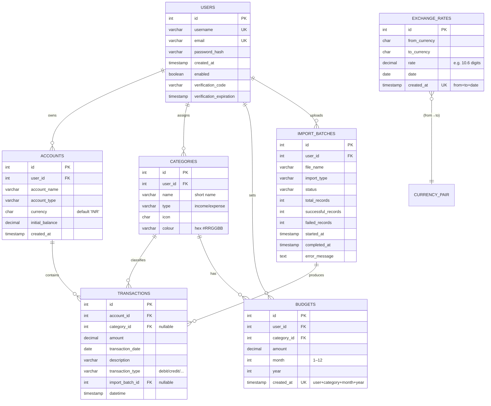

# Design Document

By Zeeshan Moin Shariff

Video overview: <URL HERE>

## Scope

* The purpose of this database is to support a finance tracker application built with Spring Boot. The database has been designed to store, organise and manage financial data of users, to enable tracking their income, expenses, budgets, etc.
* The scope of this database includes:
  * Users of this finance tracker application
  * Accounts held by these users
  * Financial transactions
  * Categories these transactions belong to
  * Budgets created by users
  * Imported transaction batches (e.g. data related to CSV imports)
  * Currency exchange rates for multi-currency support
* The scope of this database does not include:
  * Authentication mechanisms beyond basic credential storage
  * Real-time banking integrations
  * Data regarding financial analytics, insights or any form of forecasting

## Functional Requirements

* A user should be able to:
  * Register and maintain an account in the application
  * Create and manage multiple financial accounts
  * Record income and expense transactions
  * Categorise transactions
  * Define monthly budgets per category
  * Import transactions from external sources and track import status
  * Track transactions across different currencies using stored exchange rates
  * View historical transaction and budget data
* However, beyond the scope of the database functionality are:
  * Automatic categorisation using machine learning
  * Fraud detection or financial advice
  * Real-time currency conversion
  * Multi-user shared accounts
  * Audit logging of every data change

## Representation

### Entities

#### Users
* Attributes: `id`, `username`, `email`, `password_hash`, `created_at`
* Each user represents an individual using the finance tracker.
* `SERIAL` is used for the primary key to ensure uniqueness.
* Unique constraints on username and email prevent duplicate accounts.
* Passwords are stored as hashes for security.

#### Accounts
* Attributes: `id`, `user_id`, `account_name`, `account_type`, `currency`, `initial_balance`, `created_at`
* Accounts represent financial sources such as bank accounts or credit cards.
* A foreign key constraint links accounts to users with cascading deletes.
* Currency is stored as a 3-character ISO code.

#### Categories
* Attributes: `id`, `user_id`, `name`, `type`, `icon`, `colour`
* Categories classify transactions.
* Categories are user-specific.
* Colour is stored as a hex code to support UI rendering.

#### Transactions
* Attributes: `id`, `account_id`, `category_id`, `amount`, `transaction_date`, `description`, `transaction_type`, `import_batch_id`, `datetime`
* Transactions represent individual financial events.
* `DECIMAL` is used for monetary values to avoid floating-point errors.
* Foreign keys ensure referential integrity with accounts and categories.

#### Budgets
* Attributes: `id`, `user_id`, `category_id`, `amount`, `month`, `year`, `created_at`
* Budgets define spending limits per category per month.
* A composite unique constraint prevents duplicate budgets for the same category and period.
* A check constraint ensures valid month values.

#### Import Batches
* Attributes: `id`, `user_id`, `file_name`, `import_type`, `status`, `total_records`, `successful_records`, `failed_records`, `started_at`, `completed_at`, `error_message`
* Import batches track bulk transaction imports and their processing state.
* This design allows traceability and error handling during imports.

#### Exchange Rates
* Attributes: `id`, `from_currency`, `to_currency`, `rate`, `date`, `created_at`
* Exchange rates enable currency conversion.
* A unique constraint ensures one rate per currency pair per date.

### Relationships

* A user can have many accounts, categories, budgets, import batches, and transactions.
* An account belongs to one user and can have many transactions.
* A category belongs to one user and can be associated with many transactions and budgets.
* A transaction belongs to one account and optionally one category.
* A budget belongs to one user and one category.
* An import batch belongs to one user and may be associated with multiple transactions.
* Exchange rates are independent and not directly linked to users.

## Optimisations

The following optimisations were implemented:
* Indexes on `transactions.account_id`, `transactions.category_id`, and `transactions.transaction_date` to improve query performance for common transaction lookups.
* A composite index on `budgets(user_id, month, year)` to speed up budget retrieval for a given period.
* Unique constraints to prevent duplicate logical records (e.g., budgets and exchange rates).

## Limitations

The limitations of this design include:
* No support for shared or joint accounts between users
* Limited support for recurring transactions
* Exchange rates are stored historically but not automatically updated
* No built-in audit trail for data changes